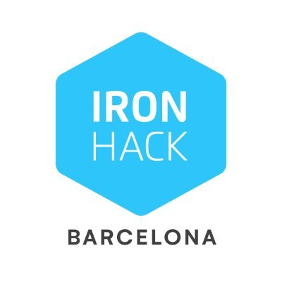

# Ironhack Course Conforcat November 2022

## Course Structure and Notes

This is the overview of the course content with personal notes.

### **[HTML](section-01-html)**

1. [Basic Layout](./section-01-html/01-basic-layout.html)  
   In this course we learned the basic html layout.

2. [Meta Tags](./section-01-html\02-meta-tags.html)
    

3. [Typography](./section-01-html\03-typography.html)  
   in this lecture we learned different types of typo tags like `<strong>`, `
`, `<del>`, `<b>`, `<i>`, `<em>`, `<mark>`, ``, ``

4. [Links](./section-01-html\04-Links.html)  
   different ways to insert a link: \_blank, \_self, \_parent, \_top

5. [Images](./section-01-html\05-images.html)    
   Here we learned how to attach an image, an image as a link to an external page, also how to add a `<figcaption>`-Figure Tag to add a title for the image

6. [Lists](./section-01-html\06-List.html)  
   Ordered and unordered Lists

7. [Layouts](./section-01-html\07-layouts.html)  
   how to structure the body inside the html, with header, nav, main, article, div, section, footer

8. [Layout Example](./section-01-html\08-layout-example.html)  

9. [Tables](./section-01-html\09-tables.html) 

10. [Inline-vs-Block-Elements](./section-01-html\10-inline-vs-block.html) 

11. [IDs](./section-01-html\11-ids.html) 

12. [Classes](./section-01-html\12-classes.html) 

13. [Semantic-Example](./section-01-html\13-semantic-example-consolodated.html) 

14. [Forms](./section-01-html\14-forms.html) 

- Form Elements and Syntax
- Form Attributes
- Input Types
- Input Attributes
- Example

- [Forms-Example](./section-01-html\14-forms-exercise.html) 
  Registration form with a bit of JavaScript

### **[CSS](./section-02-css)**

1. [**Basics**](./section-02-css\01-basic.html)  

2. [**Selectors**](./section-02-css\02-selectors.html) 

- **Root Selector**: : root{} - to declare global variables
- **Universal Selector**: \* {} - to reset the browsers default styles f.e. padding, margin, font-style...
- **Type Selector**: h1{} - this addresses all h1 ( or so ) tags in the document and gives them the same style.
- **ID Selector**: #id {}
- **Class Selector**: .classname {}
   
   
  **CSS Specificity**  
  - p.intro {} -> selects all p elements with the class="intro"
  - div,p {} -> selects all div and p elements
  - div p {} -> selects p elements inside div elements
  - div+p {} -> selects the first p element that is places inmediately after div elements -->"**first sibling**"
  - p~ul {} -> selects every ul that is a **sibling** of a p element
  - div>p {} -> selects p elements wehre the parent is a div element --> "**direct children**"
     
    **CSS Pseudo selectors** 
  - a:hover
  - a:visited
  - input:focus
  - input:valid
  - input::placeholder
  - p::first-letter
  - p::first-line
  - p::after | before
  - ::selection
     
    **directing certain elements (eg. p)**: 
  - p:first-child --> selects every p that is the first child of its parents
  - p:last-child
  - p:nth-child(n)
  - p:nth-last-child(n)
  - p:last-of-type
  - p:nth-last-of-type(n)
  - p:nth-of-type(n)
  - p:only-child

3. [**Fonts**](./section-02-css\03-fonts.html) 

- insert an external font from google fonts with the @import in stylesheet.

4. [**Text-Properties**](./section-02-css\04-text-properties.html) 

5. [**Colors**](./section-02-css\05-colors.html) 
   different ways how to define a color:

- RGBA(A = Intensity)
- HEX
- Opacity:  
  0=Full Opacity, 1 = 0 Opacity

6. [**Border-Background**](./section-02-css\06-border-backgrounds.html) 

- different ways to style borders
- how to insert an image in CSS
- background-image: url("...")
- background-size: cover || contain;
- background-repeat: no-repeat;
- background-position: center || top

7. [**Box-Model**](./section-02-css\07-box-model.html) 

- padding pushes the content to the inferior
- margin

8. [**Float**](./section-02-css\08-float.html) 

- float: left || right ||
- clear: both --> at some point you need to add a div class="clear" .clear {clear:both} to not overwrite content

9. [**Links-and-Buttons**](./section-02-css\09-links-buttons.html) 

10. [**Menu Styling**](./section-02-css\10-menu-styling.html)  

11. [**Position**](./section-02-css\11-position.html)  

- Position absolute: sets the position absolute to a relative element. only works if the container in which it is inside hast a relative position property.
- Position relative
- Position static (default)
- Position fixed:
- Position sticky: combination of static and fixed

The Position is set with TOP LEFT RIGHT BOTTOM properties.

12. [**Inline vs Block Elements**](./section-02-css\12-inline-vs-block.html)

13. [**Media Queries**](./section-02-css\15-media-query-example.html)

- to adapt the page for different screen sizes
- it allows to change certain properties to change depending the screen size
- examples:
- @media only screen and (max-width: 500px) {}
- @media (min-width: 501px) and (max-width: 768px) {}
- @media (min-width: 1201px){}
- @media (max-height: 500px{}

16. [**Flexbox**](./section-02-css\16-flexbox-basics.html)

- display: flex

**Flex Container Properties** (parent container) 

- flex-direction: row || column || column-reserve || row-reserve
- justify-content --> to align items along the x-axis: flex-start || flex-end || center || space-between || space-around || space-evenly
- align-items --> to align items along the Y-axis: flex-start || flex-end || center || baseline || stretch
- align-content --> to align flex lines
- flex-wrap
- Shorthand: flex-flow: flex-direction flex-wrap

**Flex Items Properties** (child elements)  

- order: number --> gives a specific order to the flex items
- flex-grow: number -->
- flex-shrink: number --> specifies how much a flex item shrinks relative to the rest.
- flex-basis: px --> specifies the initial length of a flex item
- Shorthand: flex: flex-grow flex-shrink flex-basis
- align-self --> overrides the align-items prop of the flex-container.

17. [**GRID**](./section-02-css\17-grid-basics.html)

- [external Link - Complete Guide Grid](https://css-tricks.com/snippets/css/complete-guide-grid/)

- Grid Container - "Parent Container" in which the grd is being applied.
- Grid Item: direct children, but children of children (sub-item) ist not being affected
- Grid Line: vertical or horizontal lines
- Grid Cell: is a single unit of the grid.
- Gid Track: whole column or row
- Gid Area: area of various cells.

**Display Properties for the Parent (Grid Container):**  

- display: grid || inline-grid
- grid-template-columns: "size of first column" "size of second column" auto "size of fourth column" "size of fifth column"...
- grid-template-rows: "size of first row" "size of second row"...
- --> can be in px % auto
- **MAX amount of columns is 12!!!**
- "-1" can be used for the last row.
- [first] 40px [line2] 20px... inside the [] you can give the lines a specific name
- a line can also have more than 1 name [name 1 name 2] x px e.g. [row1-end row2-start]
- **Repeat**: repeat(number of columns, fraction(fr)||size(px) [name of column])
- The **fr** --> calculates the size to be evenly spreaded inside the size of the container.
- grid-template-area: adding names to areas/cells which are then referenced to the grid area name of the child child element.
- --> grid-template-area Name has to be defined in the parent-div-class --> makes reference to the grid area Name --> which is defined in the child-div-class
- **Shorthand:** grid-template: [row 1 name] 25% "header header header" [row 2 name] 25% "footer footer footer" / auto auto

-
- column-gap // row-gap // grid-column-gap // grid-row-gap
- gap Shorthand: gap: 10px(row-gap) 20px(column-gap)

**Display Properties for the Children (Grid Items)**  

- grid-column-start: number of column || or name of column
- grid-column-end:number of column
- grid-row-start: number of row
- grid-row-end: number of row
- ..> with SPAN it fills out
- Shorthand for this:

  - --> grid-column: 3 / span 2 --> (start at column 2 and expand 2 positions)
  - --> grid-row: third-line / 4 --> (start at third line )

- [Grid Example 1](./section-02-css\17.1-grid-example1.html)
- [Grid Example 2](./section-02-css\18-grid-basic-example.html)
- [Grid Example 3 - layout e-commerce](./section-02-css\18-grid-example-e-commerce-exapmle-.html)

- [Grid Example INSTAGRAM LANDING PAGE CLONE](./section-02-css/exercise-Instagram-Grid/index.html)
  - --> work in progress
     
     

---

### **[LABORATORIES](./LABS/)**  

1. [**LAB Iron Skydive Clone**](./LABS/HTML-CSS/labs-IronSkydive/)
     

2. [**LAB Recipes Clone**](./LABS/HTML-CSS/lab-css-recipes-clone/)
     

3. [**LAB Spotify Clone Exercise**](./LABS/HTML-CSS/lab-css-spotify-clone-master/index.html)
     

---

 

### **[JAVA SCRIPT](./section-03-js/)**

 
Potential Interview questions (each link will take you to external resources, feel free to click them and learn more): JavaScript is a [prototype-based](https://en.wikipedia.org/wiki/Prototype-based_programming), [multi-paradigm](https://en.wikipedia.org/wiki/Programming_paradigm#Support_for_multiple_paradigms), [dynamically typed language](https://developer.mozilla.org/en-US/docs/Web/JavaScript/Data_structures), [supporting object-oriented](https://developer.mozilla.org/en-US/docs/Learn/JavaScript/Objects/Object-oriented_JS), [imperative and structured](https://en.wikipedia.org/wiki/JavaScript#Imperative_and_structured), and declarative (e.g. [functional programming](https://en.wikipedia.org/wiki/JavaScript#Functional)) styles.
  

[**01-JS-basics**](./section-03-js/01-js-basics.html)

- insert JS inside the HTML inside the body in a script tag.
- linking an external file with "<"script scr="link to js file"">"

[**03-JS-Intro**](./section-03-js/03-intro.js)

- Introduction of the console
- console.log(document) --> opens #document in the console and shows the structure and all elements of the document.
- Dot Notation - to get specific information about the document e.g. console.log(document.URL)
- document.all -- returns all posititions sementically
- with innerText / innerHTML this way you can also change the content of the html e.g. console.log(document.all[8].innerText = "WU TANG CLAN IS FOR THE CHILDREN")
- console.table(["Barcelona", "Berlin", "Tokyo", "Liverpool"]) --> shows a table in the console

[**04-Data Types**](./section-03-js/04-data-types.js)

- Primitive Data: number, string, boolean, Null, undefined, symbol
- Non Primitive Data:
  - Object { key: "value", key: "value"}
  - Array ["text", "text", "text"]
  - usual structure: various objects within an array, in those objects there can be other objects or arrays --> NESTED STRUCTURE
  - arrayName = [ {key: "value" }, {key: ["text", "text"]}]
  - Accessing Objects with .dotNotation
  - Accessing Arrays with []BracketNotation

[**05-Variables**](./section-03-js/05-variables.js)

- Variable Declaration with let varName , var varName (outdated)
- Variable Initialization varName = 1; varName = "Hello"
- const firstName = "Raphaela"
  - with const you have to declare and initialize at the same time.
- Naming Conventions:
  - variables have to start with letter(lowerCase), \_ (underline), $
  - camelCase !!!!
- let and var variables can be reassigned, const cannot be reassigned.
- TEMPLATE LITERAL `${variable}`

[**06-Operators**](./section-03-js/06-operators.js)

- Assign Operators:
  - "+" "-" "\*" "/", "++", "--", "\*\*"(exponention)
- Arithmetical Operators:
  - "==" "!=" "===" "!==" ">" ">=" "<" "<="
  - return either true or false
- Logical Operators:
  - "&& AND, "|| OR", "! NOT"

[**07-Conditionals**](./section-03-js/07-conditionals.js)

- If Statement
  - if (condition) {  
    code to execute  
    }  
- If .. Else Statement:
  - if (condition) { code to execute if condition is true } else { other code if first condition is false}
- Else If Statement .. connection of various if statements
  - if(condition1) {code to execute} else if (condition2) {code to execute} else if (condition 3) {code to execute} else {default code if nothing of the above is true}
- nested conditionals are possible too

- **Ternary Operator**:

  - condition ? expr1 : expr2
    - if condition is true, expr 1 will be executed, if condition is false, expr 2 will be executed --> 50/50 Use Cases
  - condition1 ? expr1 : condition2 ? expr3 : expr 2

- **Switch Statement**:
  - switch ( variable/expression) {
  - case "x":
  - code to execute;
  - break;
  - case "y":
  - code to execute;
  - break;
  - default:
  - code to execute;
  - }

**Methods**

- .toUpperCase()
- split()
- reverse()
- join()
- parseInt()
- parseFloat()

[**08-Functions**](./section-03-js/08-functions.js)

- for code which you want to reuse.
- better to make "small" functions instead of "long complex" functions --> divide complex problem in several smaller programs.
- Syntax:
  - function functionName (parameter1, parameter 2, ...) { code }
- Call the function:
  - functionName (argument1, argument);
- Return Statement:
  - indicates the end of a function, code that comes afterwards will not be executed
  - it will be stored and can be used to return the value in a variable,
- A function can be inserted as a value in a variable

- Anonymus Function -

- Function Expression - are anonymus functions without name stored in a variable and it runs alone

- **Arrow Function:**
  - let myFunctionName = (param1, param2) => {code return}
    - if only one line of code/ one instance of code -> "return" and {} is not necessary
    - if only one parameter -> () is not necessary

[**09-LOOPS**](./section-03-js/09-loops.js)

1. For Loop

- for (initial expression; condition; actualized expression) { code }
- for (let i = 0; i < array.length; i++) { code }
- [ i ] .. to loop in arrays
- . .. to get information of an object in an array

2. While Loop:

- while (condition){code; variation of variable}
- the variable inside the condition has to be changed, otherwise it will end in an infitive loop.

[**10-ARRAY METHODS**](./section-03-js/10-array-methods.js)

1. .map( () => {})

- creates a new array with the results of calling a function provided on each element of this array.

2. .filter( () => {}):

- creates a new array with only the elements that meet the condition inside the function

3. .sort()

- This method is used to sort the array elements in ascending or descending order.
- arr.sort((a,b)=>(a > b ? -1 : 1)) --> ascending
- arr.sort((a,b)=>(a > b ? 1 : -1)) --> descending

4. .forEach( (element) => { } )

- This method helps to loop over an array by executing a callback function provided(CALLBACK) for each element of an array.

5. .concat(array1, array2)

- This method is used to merge two or more arrays [ARRAYS] and returns a new array, without changing the existing arrays.

- combines two or more arrays and returns a new array

6. .every( (element) => { } )

- returns either true or false depending a condition, checks every element of the array

7. .some()

- returns either true or false if at least one of the elements passes the condition

8. .includes()

- checks if there is an element inside the array that passes the condition, returning true or false.

9. .join()

- returns a new string which will be combined by the thing in the () eg. (""),

10. .reduce((total, current)=> { })

- This method applies a function against an accumulator and each element of the array to reduce it to a single value.
- array.reduce((total, current) => total + current) --> SUM OF ARRAY
- array.reduce((total, current) => total.length >= current.length ? total : current) --> LONGEST ELEMENT OF AN ARRAY

11. .find()

- arr.find((element) => condition for the element we want to find)
- returns the value of the first element of an array that passes the test in a check function.

12. .findInIndex()

- returns the index of the first element of an array that passes the test in a check function.

13. .indexOf()

- returns the index of the first occurrence of the specified element ("dog") in the array, or -1 if it is not found.
- .indexOf("dog")

14. .fill()

- fills the elements of an array with a static value and returns the modified array.
- array.fill(["dd", "Hello"])

15. .slice()

- returns a new array with the specified elements from start to end.
- array.slice(beginning index, ending index)

16. .reverse()

- inverts an array instead. The element at the last index will be the first and the element at index 0 will be the last.
- array.reverse()

17. .push()

- **adds** one or more elements to the **end** of the array and returns the new length of the array.
- array.push("Dog")

18. .pop()

- **removes** the last element from the **end** of the array and returns that element.
- array.pop()

19. shift()

- **removes** the **first** element at the beginning of an array and returns the new length of the array.
- array.shift()

20. .unshift()

- **adds** one or more elements to the **beginning** of an array and returns the new length of the array.
- array.unshift("Horse")
   
   
  other Methods within in the Lab  

- Math.max(num1, num2)
- true = 1, false = 0

- toFixed() --> rounds a number to a specific number of decimals. --> number.toFixed(number of decimals)

[**11-DOM MANIPULATION 1**](./section-03-js/11-DOM-Manipulation.js)

- DOM (Document Object Model) is an API (Application Programming Interface) for HTML and XML documents. It provides a structured representation of the document (web page) and defines a way that the structure can be accessed from JavaScript. This allows us to change the document structure, style or content from JavaScript!

- document - will return the source code of the website.
- each element of the document is possible to target.. for further use/manipulation
- console.log(document.title)
- console.log(window)

**How to target the elements**

1. getElementById - Method:

   - let element = document.getElementById("id-name")

2. getElementByClassName - Method:

   - let element = document.getElementByClassName("class-name")
   - if there are various classes with the same name - possiblity to target each one by their index [0]

3. getElementByTagName () - Method:

   - let element = document.getElementByTagName("h3")[0]
   - by [] Notation target specific h3

4. getElementByQuerySelector() - Method:

   - uses the same approach and specifity as in CSS
   - selects the first id/class/tag.. found
   - document.getElementByQuerySelector("#id-name")
   - document.getElementByQuerySelector(".class-name")
   - document.getElementByQuerySelector("h5") --> targets the first h5 tag!
   -
   - document.getElementByQuerySelector("#id-name .class-name .class-name2")

5. querySelectorAll(".class or #id")

   - returns a Node List of all occuring .classes or #id

6. Selectors for Parent, Children and Siblings

   - document.querySelector("#idname").lastElementChild
   - document.querySelector("#idname").firstElementChild
   - document.querySelector("#idname").children
   - document.querySelector("#idname").children[2]
   - document.querySelector("#idName").parentNode --> shows the parent id/class
   - document.querySelector("#idName").parentElement
   - document.querySelector("#idname").nextElementSibling
   - document.querySelector("#idname").previousElementSibling

[**Dom Manipulation 2**] 

- create Elements via JS:

  - elementDiv = document.createElement("div")

- Insert Content via JS:

  - element.innerText // .innerHTML

- .appendChild

  - elementDiv = document.createElement("div")
  - element2 = document.querySelector("#parent #firstChild).appendChild(elementDiv)

- add new class with JS:

  - Element.classList.add("")

- assign an element a className

  - var = document.createElement("div")
  - var.className = "example"

- insert an element before another one

  - parentElement.insertBefore(new Element, element above which new element will be inserted)
    - --> parentElement is the section (body, specific div) where you want to insert the new element

- var.replaceChild(newElement, what we want to replace)

- parentElement.removeChild(element we want to remove)

- emailElement.innerHTML = ""

  - to clear the whole element
       

- **insert CSS STyles with JS**

- create a variable which targets the button
  - buttonEL = document.querySelector("#master")
- create a function
  - addFunction () => buttonEl.classList.add("classNameCSS") "no dot necessary here as it will insert this classNmeCSS in Html !!!"
  -
- give it an event:

  - addEventListener("type of event eg click", functionName)
  - buttonEl.addEventListener("click", addFunction)

- .classList.add/remove/toggle

- toggle is to alterate between classes

**[13-Browser-Events](./section-03-js/13-browser-events.html)**

- work with tailwindcss.com --> CSS Library
- insert link inside head with ''
- gets all the predefined styles from this library and you only need to insert the classes in you html tags.

- Event Handlers with addEventListener

  - events: click, dblclick, mousemove, keypress

  - button.addEventListener("event", defined function1, defined function 2...)

    - --> function needs to be defined before - but can be reused in other Events

  - button.addEventListener("event", function(){..})
    - --> function can be defined inside the addEventListener

- Event Handlers with method:

  - button.oncklick = function(){..} // button.oncklick = () => { }
  - oncklick, ondblclick, onmousemove, onkeypress

- Assign Event Handlers with method directly inside the button tag in the html
  - <button oncklick="alert("hello WOrld")">Click me < /button>
  - < button oncklick="alert(Date())">Click me < /button>
  - < button oncklick="( () => alert("hello world")) </button> .. inserting a function directly
  - < button oncklick="functionName()">Click me </> .. inserting a defined function from js

**[Browser-Event-EXERCISES-in-Class](./section-03-js/13-events-exercise.html)**

**[14-Async](./section-03-js/14-async.-class.js)**

- Async Operations are when one operation for example takes some time to execute bc it is operating with an external server to fetch data, but meanwhile, with this function it does not stop the other functions from being executed and the flow can continue without stops.
- with f.e. setTimeout(), the execution of a "longer, time consuming" function can be set for x seconds and the functions below continue to be executed.

- setTimeout()

  - setTimeout(function, milliseconds)
  - runs the function after the time set inside the setTimeout function

- clearTimeout()

  - when we want to stop the calling of a function
  - clearTimeout(intervalID) (reference to the function you want to stop)

- setTimeout(function, miliseconds, param1, param2, ...)

  - the parameters are the parameters/arguments of the function

- **Callback Functions**

  - A callback function is a function passed into another function as an argument, which is then invoked inside the outer function to complete some kind of routine or action.
  - function (param1, callback (eg. callMe)) {.. callback ()}
    - callback: function callMe() { .. }

  --> VIEJA ESCUELA!! MORE COMPLICATED AND EASY TO COMMIT ERRORS!!!!

- **Promises**

  - The Promise object represents the eventual completion (or failure) of an asynchronous operation and its resulting value.

  - let promise = **new** Promise((resolve,reject)=>{ resolve(); reject() })
  -
  - resolve and reject are functions
  - if promise has exit - resolve() will be executed
  - if promise fails - reject() will be executed
  -
  - Promise can have different states:

    - pending: initial state, neither fulfilled nor rejected.
    - rejected: the operation failed.- error
    - fulfilled: the operation was completed successfully.

  - Chaining Promises: .then() .catch() .finally()

    - .then((successValue(result))=>{.log(result).}) -> only will be executed if Promise is resolved

    - .catch( errorValue(result)=>{..log(result).}) -> will be executed if Promise fails

    - .finally( fName = () => {..}) -> will be executed independently of state resolved / rejected

  - <u>Promises run automatically<u> (whereas a Callback functions which need to be called)

- **Async / Await**

- async function fName(parameter1, parameter2, ...paramaterN) {...}
- const var = async () => { await otherFunction.. if...else..}
- you have to call the function: var();
- inside the var function, first it will check the otherFunction, and depending on the outcome of that function, it will execute the code below

- **Async Try Catch**

  - const var = async () 0> { try { await } catch {} }

**[Examples CallBack Functions, Promises, Async/Await, Async/TryCatch](./section-03-js/async/)**

---

### LABORATORIOS JS

**[LAB-Basic-Algorithms](./LABS/JS/01-JS-Basic-Algorithms/)**

**[LAB-Functions-and-Arrays](./LABS/JS/02-lab-javascript-functions-and-arrays-master/)**

**[LAB-Ironhack-CART](./LABS/JS/03-lab-dom-ironhack-cart-master/)**

**[LAB-GREATEST-MOVIES](./LABS/JS/04-lab-greatest-movies/)**

**[LAB----------](./LABS/JS//)**

**[LAB-PROMISES](./LABS/JS/06-lab-promises-master/)**
